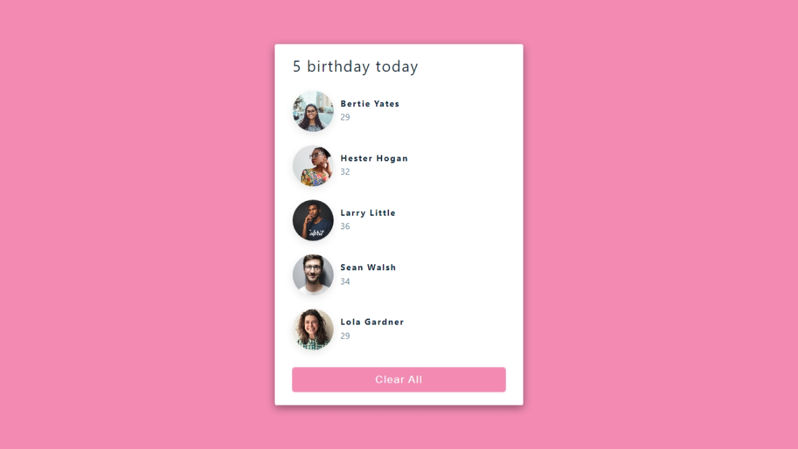

#  React Tutorial and Projects Course (2022)

The repository contains the projects I created during the course [React Tutorial and Projects Course (2022)](https://www.udemy.com/course/react-tutorial-and-projects-course/learn/lecture/22580994#content).

## Description of the projects

### Birthday Reminder
A simple website that displays who is having a birthday today.

The page gets data from the data.js file. The data is saved as an object in the list.

A [live version]() of the page is available.