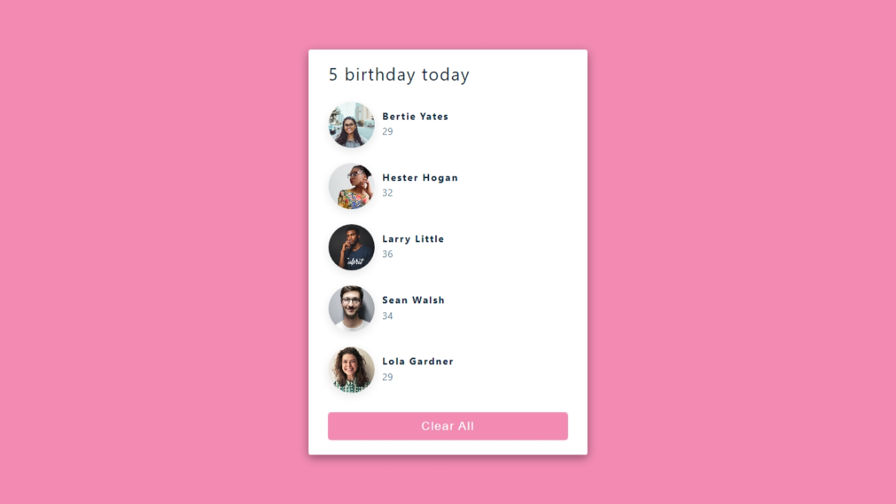

#  React Tutorial and Projects Course (2022)

The repository contains the projects I created during the course [React Tutorial and Projects Course (2022)](https://www.udemy.com/course/react-tutorial-and-projects-course/learn/lecture/22580994#content).

## Description of the projects

### Birthday Reminder
A simple website that displays who is having a birthday today.



The page gets data from the data.js file. The data is saved as an object in the list.

``` js
export default [
  {
    id: 1,
    name: 'Bertie Yates',
    age: 29,
    image: 'https://res.cloudinary.com/diqqf3eq2/image/upload/v1595959131/person-2_ipcjws.jpg',
  },
];
```

A [live version](https://petitoff-birthday-reminder.netlify.app/) of the page is available.
